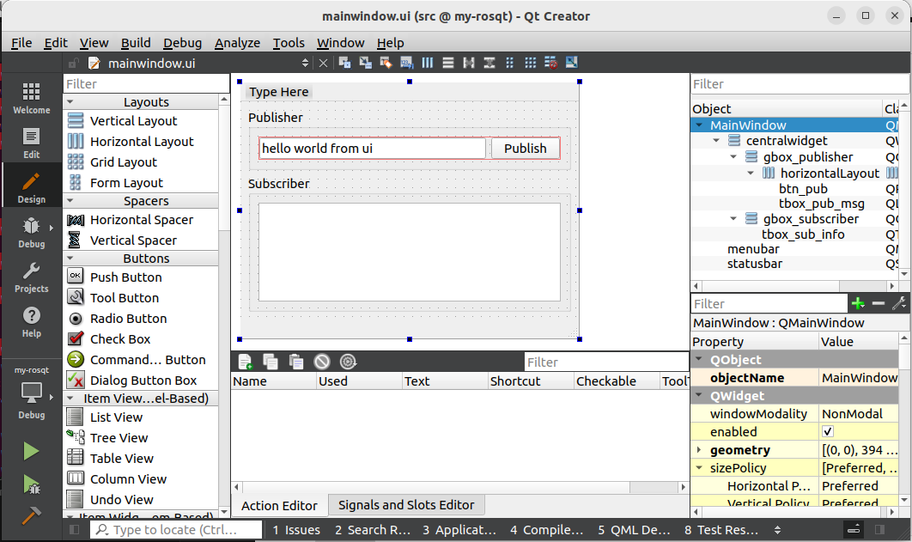
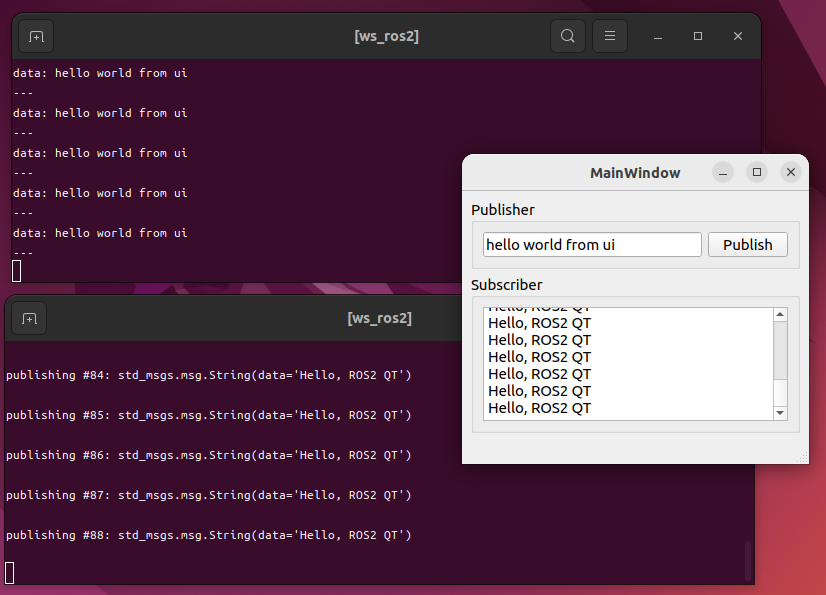
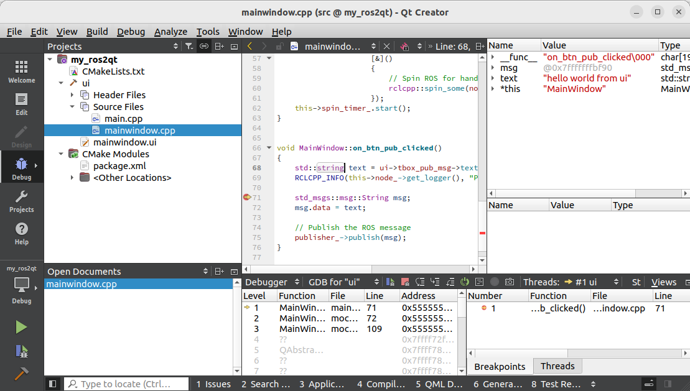
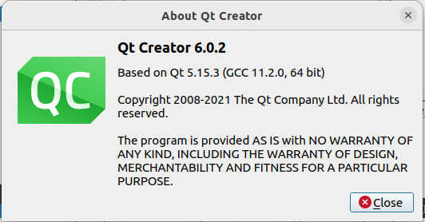

# Readme

This project provides a simple script to initialize a Qt environment with ROS 2. You can edit and compile using Qt Creator or compile it into a node using ROS 2's colcon build system. You can then run the UI using 'ros2 run'.





## Usage

```shell
cd Downloads
git clone https://github.com/HowardWhile/ros2-qt-package-creator.git
source ros2-qt-package-creator/setup.bash
```

```shell
create-new-ros-qt-package <PKG_NAME> <NODE_NAME>
```


## Create new package in an existing workspace

**Create package with ui node**

```shell
#source <setup.bash> You can add it to the bashrc of your terminal by yourself.
source ~/Downloads/ros2-qt-package-creator/setup.bash

#cd <src folder of your ROS workspace>
cd ~/ros2_ws/src

#create-new-ros-qt-package <PKG_NAME> <NODE_NAME>
create-new-ros-qt-package my_ros2qt ui
```

#### **Compile and Run**

```shell
# source /opt/ros/humble/setup.bash
cd ~/ros2_ws
colcon build

# source <path to your ROS workspace>/install/setup.bash
source install/setup.bash

ros2 run my_ros2qt ui
```

#### **Test**

**list topic**

```shell
ros2 topic list
```

You can see similar messages....

```shell
/parameter_events
/ros2qt_pub
/ros2qt_sub
/rosout
```

**echo topic with command line**

```shell
ros2 topic echo /ros2qt_pub
```

**publish topic with command line**

```shell
ros2 topic pub /ros2qt_sub std_msgs/msg/String "data: 'Hello, ROS2 QT'"
```


## Open Package with QtCreator

```shell
# source <path to your ROS workspace>/install/setup.bash
cd ~/ros2_ws
source install/setup.bash
qtcreator src/my_ros2qt/
```

And after compiling, you can run or debug this project.



## Version

#### OS

```shell
sb_release -a
No LSB modules are available.
Distributor ID:	Ubuntu
Description:	Ubuntu 22.04.4 LTS
Release:	22.04
Codename:	jammy
```

#### ROS

```shell
printenv ROS_DISTRO
humble
```

#### QT Creator



**Qt Creator 6.0.2**

Based on Qt 5.15.3 (GCC 11.2.0, 64 bit)

Copyright 2008-2021 The Qt Company Ltd. All rights reserved.

**Install**

```shell
sudo apt install qtcreator
```


